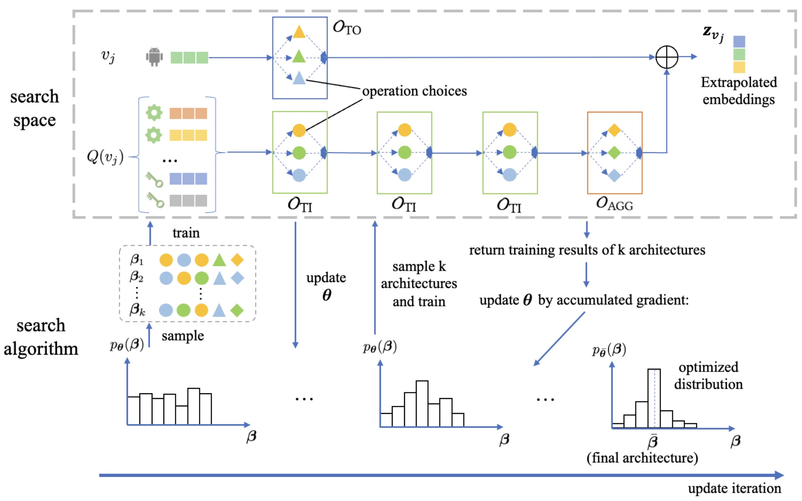

## S2E-OOG

+ Code for "Searching to Extrapolate Embedding for Out-of-graph Node Representation Learning"
+ Our dataset is in the [link](https://cloud.tsinghua.edu.cn/d/19fcdb19edcd415eabfe/), please put that dataset folder in current path. 

### Environment configuration (for reference)
  + torch            1.13.1
  + dgl              0.9.1.post1
  + torch-geometric  2.2.0  

### GPU setting (for reference)
  + 24 GB NVIDIA GeForce RTX 3090 GPU

### Run codes for training
  + python main.py -d ACM -e 30 -t 2
  + python main.py -d IMDB -e 20 -t 2
  + python main.py -d OPPO -e 50 -t 3

### Run codes for inference
  + python inference.py -d ACM
  + python inference.py -d IMDB
  + python inference.py -d OPPO
